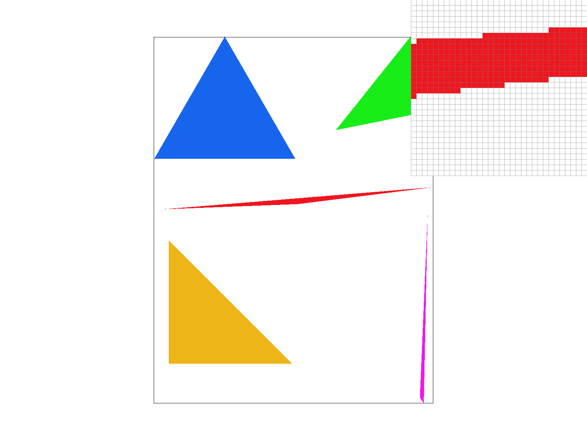
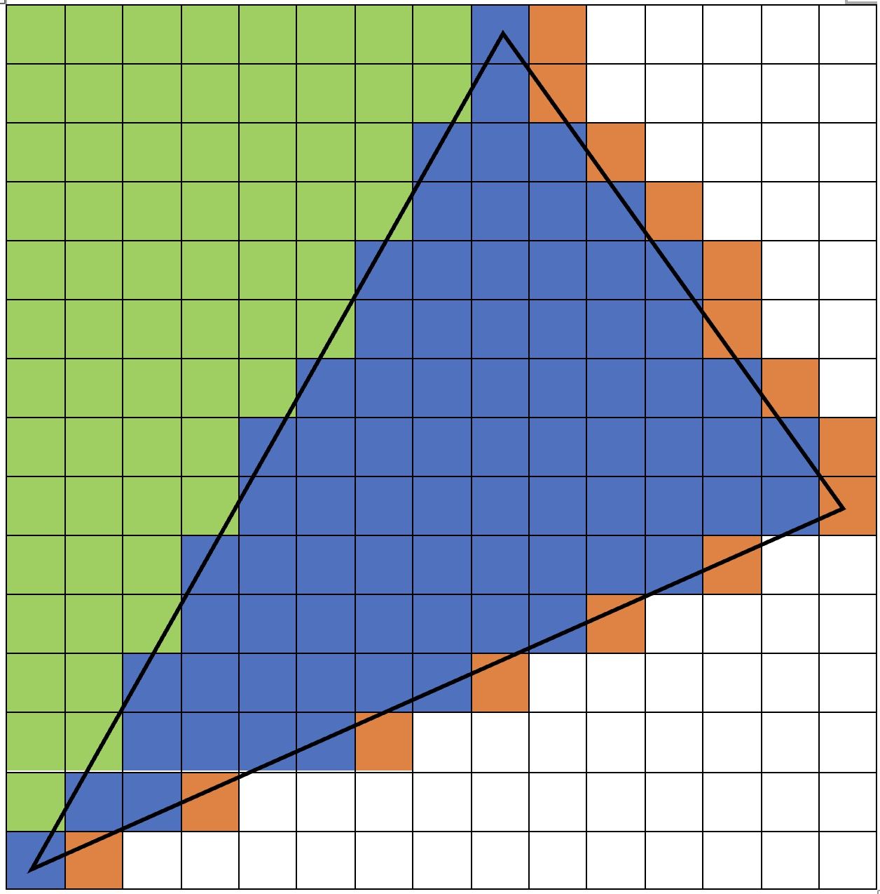
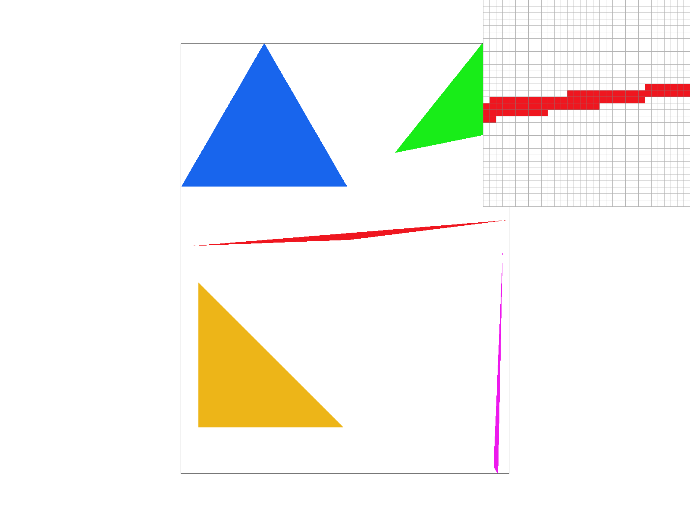
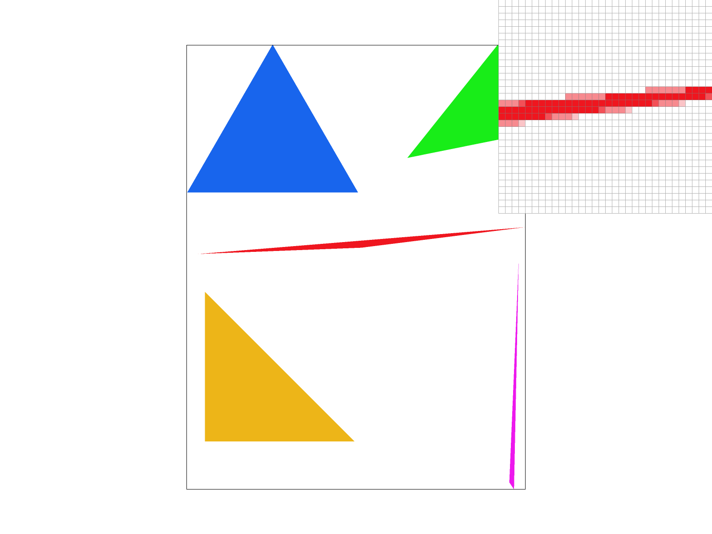
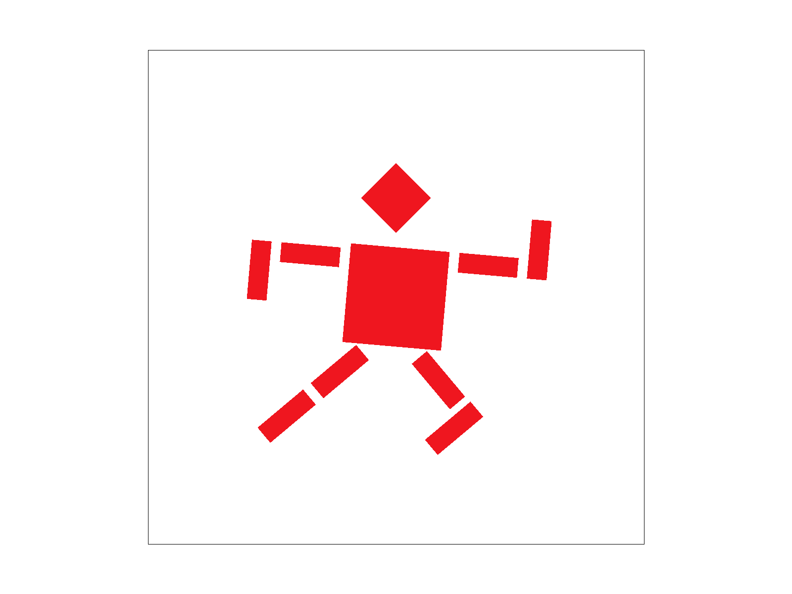
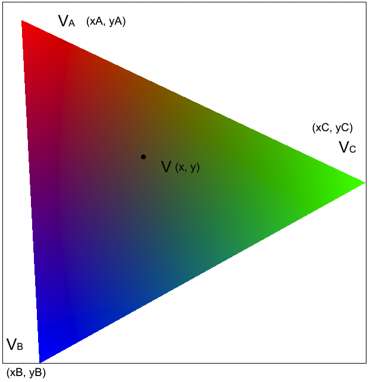
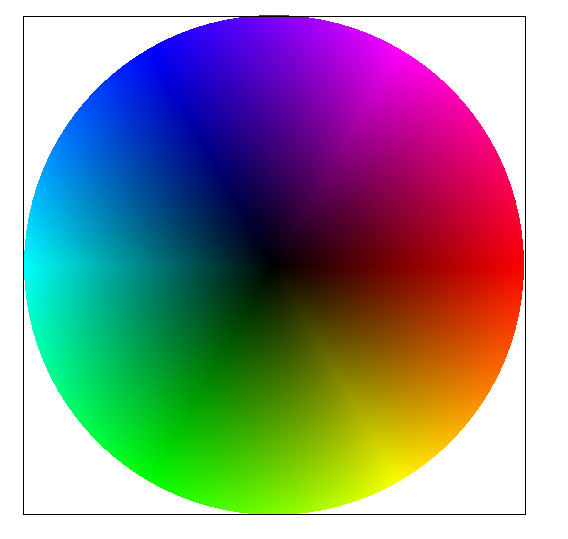
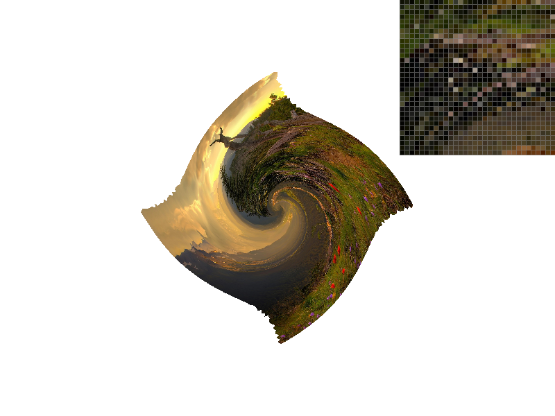

<script src="https://cdn.mathjax.org/mathjax/latest/MathJax.js?config=TeX-AMS-MML_HTMLorMML" type="text/javascript"></script>

# Setup

The project is compiled with `Apple clang version 14.0.0`.

All tests are performed on a 2021 MacBook Pro with Apple M1 Pro CPU (ARM) with default resolution 1600x1200 (unless otherwise specified).

# Overview
In this project, we implemented a simple SVG viewer based on the starter code we received. 

In particular, we implemented different methods to resterize triangles and apply transformations to these triangles. We also implemented anti-aliasing using different techniques.

# Part 1: Rasterizing Simple Triangle
We implemented the following algorithm to rasgerize simple triangles
1. Find the bounding box for the triangle by finding $$x_{max} = max(x_0, x_1, x_2)$$, $$x_{min} = min(x_0, x_1, x_2)$$ and $$y_{max} = max(y_0, y_1, y_2)$$ and $$y_{min} = min(y_0, y_1, y_2)$$.
2. Loop over all each pixel $$(x, y)$$ with $$x_{min} <= x <= x_{max}$$ and $$y_{min} <= y <= y_{max}$$ and perform point-in-triangle test (described in lecture) on the point $$(x + 0.5, y + 0.5)$$ to determine if this point is in the triangle with vertices $$(x_0, y_0), (x_1, y_1), (x_2, y_2)$$.
3. Set `sample_buffer[y * width + x]` with the corresponding color if the point-in-triangle returns `true` in the above step.

Since the winding-order of the vertices are not fixed for our reasterizer, we need to modify the point-in-triangle test a little bit for our purpose. In particular, after computing `L0`, `L1` and `L2` using the formula from the lecture, we check if `(L0 >= 0 && L1 >= 0 && L2 >= 0) || (L0 <= 0 && L1 <= 0 && L2 <= 0)`. That is, the point is in the triangle if either the point is 'inside' all three lines or 'outside' all three lines. Notice also that all checks allows the case `== 0` since the prompt mentioned that we should render points on the bondary as well.

This implementation is no worse than the one that checkes every point in the bounding box because it does exactly checking every point in the bounding box. We implemented some optimizations like loop-reordering and early breaking which you can find more information on in the Extra Credit section below.




## Extra Credit:
From CS267, we learned that loop reordering could help us gain extra performance when operating on matrix (or matrix-like) data stored in row or column majored format. Since `sample_buffer` is basically a 2D matrix stored in row major format, we decided to implement loop reordering. Loop re-ordering is implemented simply as swaping the outer and inner loop variable. 

We basically changed the loop order from
```cpp
for (int x = 0; x < width; ++x) {
    for (int y = 0; y < height; ++y) {
        // work with the pixel at (x, y)
        ...
    }
}
```
To
```cpp
for (int y = 0; y < width; ++y) {
    for (int x = 0; x < height; ++x) {
        // work with the pixel at (x, y)
        ...
    }
}
```

We also noticed that triangle is convex. Therefore, when scanning over a row, once we left the region inside triangle, we would never re-enter the triangle again in the same row. This means that we can break the ineer loop (which scans over a row) early if we detected that we have left the region inside the triangle.



The above images shows an example of the execution. We would start our inner loop at the left border, then break on the orange pixel and skip the rest of the line. 

Here is an comparison of run time for some example images with optimization on and off. All run times are average of three runs.
|File Name|No Optimization|Loop Reordering|Early Break and Loop Reordering|

|---------|---------------|---------------|-----------|
|`basic/test3.svg`|17.93ms|17.46ms|11.40ms |
|`basic/test4.svg`|0.984ms | 0.975ms | 0.561ms|
|`basic/test5.svg`|2.98ms| 2.99ms | 1.86ms|

We have, on average of the three test cases, archieve 38.99% improvement in rendering speed with only these two very simple optimizations implemented. (It takes less than 10 lines of code changes.)


# Part 2: Super-Sampling
On a high-level, our approach towards super-sampling is to use `sample_buffer` as a high-resolution screen space. Then, on `resolve_to_framebuffer` call, we will downsample the `sample_buffer` array to fill the `framebuffer`.

Here is our modified rasterizing pipeline:
1. Re-size the `sample_buffer` array to size `width * height * sample_rate`
2. On `rasterize_triangle`, scale up `x0`, `x1`, `x2`, `y0`, `y1` and `y2` by `sqrt(sample_rate)` (that is `x0` becomes `x0 * sqrt(sample_rate)` etc.)
3. Perform `rasterize_triangle` as in task 1 with the scaled up coordinates
4. On `resolve_to_framebuffer`, add an inner loop that takes the average of the colors in the `sqrt(sample_rate)` by `sqrt(sample_rate)` sample area. The pesudo code looks like following : 
```cpp
for (int x = 0; x < width; ++x) {
    for (int y = 0; y < height; ++y) {
        // average the sample area
        Color avg = Color::Black;
        for (int i = 0; i < sqrt(sample_rate); ++i) {
            for (int j = 0; j < sqrt(sample_rate); ++j) {
                avg += (1 / sample_rate) * sample_buffer[x * sqrt(sample_rate) + i][y * sqrt(sample_rate) + j];
            }
        }
        rgb_framebuffer_target[x][y] = avg;
    }
}
```
For simplicity, the `sample_buffer` and `rgb_framebuffer_target` here are represented as a 2D array. In practice, coordinates are translated into its appropriate index.

Nyquist Theorem suggests that aliasing is an artifact from signal frequence exceeds Nyquist frequency (half the sampling frequency). Therefore, in order to reduce alicasing, we could either increase the sampling frequency (which, as a result, increases Nquist frequency) or reduce the signal frequency. 

However, as we are limited by the hardware we have, it would be difficult or costly to increase sampling frequency, therefore, it is more feasiable to reduce signal frequency. That is where supersampling comes in. 

Supersampling works similar to applying a 1-pixel box-blur to the `sqrt(sample_rate)` by `sqrt(sample_rate)` area. This way, the signal frequency would be reduced (as we blured the original image), thus reducing aliasing.

We can clearly see this "blur" (caused by supersampling) in motion in the three figures below.

|Sample Rate = 1|Sample Rate = 4|Sample Rate = 16|
|---|---|---|
|||

As we can see from the figures, with higher supersampling rate, the less aliasing appears. This is because with higher supersampling rate, we are taking average color of a larger area. This is effectively taking a box-blur on a larger box. That is, we are eliminating (filtring out) more of high frequency signals in the the original triangles. Thus, we get less aliasing as an result.

# Part 3: Transformation
We have created a running robot. I applied rotation to part of the arms and the legs. Then adjusted positions (using `translate`) of these components. Lastly, I applied a slight rotation to the entire body (torso + arms + legs) to create a feeling of speed.



# Part 4: Barycentric Coordinate
Barycentric coordinates are a method of representing a point within a triangle by using three weights that add up to one. These weights are proportional to the distances between the point and the triangle's three vertices. Consider a triangle with valus at three vertices: \(V_A\), \(V_B\), and \(V_C\). Then the value at each point within the triangle can be represented by a distinct set of barycentric coordinates \(\alpha, \beta, \gamma\), which are the weights associated with each vertex.
<div style="width: 100%;display:flex;margin:20px 0px">
<div style="flex: 1;display:flex;flex-direction: column;align-items: center;">

<span>Feature: task4 triangle</span>
</div>
<div style="flex: 1;display:flex;flex-direction: column;align-items: center;">

<span>Feature: task4 color-gradient</span>
</div>
</div>

According to the `Feature: task4 triangle` shown above, we can calculate each weight with the following equations:
$$\alpha = \frac{-(x - x_B)(y_C - y_B) + (y - y_B)(x_C - x_B)}{-(x_A - x_B)(y_C - y_B) + (y_A - y_B)(x_C - x_B)}$$
$$\beta = \frac{-(x - x_C)(y_A - y_C) + (y - y_C)(x_A - x_C)}{-(x_B - x_C)(y_A - y_C) + (y_B - y_C)(x_A - x_C)}$$
$$\gamma = 1 - \alpha - \beta$$
And then the value at \((x, y)\) can be calculated by \(V = \alpha V_A + \beta V_B + \gamma V_C\). `Feature: task4 color-gradient` (svg/basic/test7.svg) is another svg graph rasterized with the barycentric coordinate method.


# Part 5: Texture Mapping - Pixel Sampling
Texutre mapping is the process of applying an image (texture) onto the shape / object we are trying to render. Pixel sampling is the way we implement this texture mapping. In general, pixel sampling works by finding a mapping between each pixel on the shape / object to a set of (one or more) texture pixels (i.e., texels) in the texture. At the time of rendering, for each pixel on the shape / object, we then use the mapping to find the set of texels best corresponds to that pixel on screen and use that set of texel to determine which color we should assign to that pixel.

In our implementation specifically, we are asked to apply pixel sampling to each triangle. We were given the texture space coordinate $$(u_i, v_i)$$ for each vertex ($$i \in \{0, 1, 2\}$$) of the triangle. We then perform pixel sampling as following:
1. For each pixel that is inside the triangle, we compute the Barycentric coordinate of that pixel. We get $$\alpha$$, $$\beta$$ and $$\gamma$$ which is our weight from each vertex of the triangle to that pixel.
2. We then use these three weights to get the texture space coordinate for that pixel. That is, the texture space coordinate for that pixel is $$(u_{px}, v_{px}) = \alpha * (u_1, v_1) + \beta * (u_2, v_2) + \gamma * (u_3, v_3)$$
3. Depending on the sampling method (nearest vs. bi-linear), we use $$(u_{px}, v_{px})$$ to compute what color we should assign to that pixel.

We implemented two pixel sampling techniques:
#### Nearest Sampling
For this technique, We simply take the color of the texel nearest to the coordinate $$(u_{px}, v_{px})$$ as the color that we assign to the pixel.

#### Bi-linear Sampling
For this technique, we will take the four texels ($$t_1, t_2, t_3$$ and $$t_4$$) surrounding the coordinate $$(u_{px}, v_{px})$$, we then apply `lerp` (weighted average on $$(u_{px}, v_{px})$$) repeatively to get the resulting color $$c = \text{lerp}(\text{lerp}(t_1, t_2), \text{lerp}(t_3, t_4))$$.

Here is some screenshot using different sampling methods and at different sampling rate. For better presentations, these screenshots are captured with screen resolution 800x600, (you might want to zoom in a little bit for better result)

|Nearest Sampling, Rate = 1|Bi-linear Sampling, Rate = 1|
|------|-------|
|||

|Nearest Sampling, Rate = 16|Bi-linear Sampling, Rate = 16|
|------|-------|
|||

As we can see from the screenshot, bi-linear sampling reduces texture aliasing by a lot when supersampling is not activated. However, the result of bi-linear sampling is not so noticeable when sampling rate is 16. This result is in line with the lecture content. Since supersampling would still work in anti texture aliasing, the result of other anti-aliasing measure would become less noticible.

# Part 6: Texture Mapping - Level Sampling
Sometimes, the size of the texture image and the size of the screen space we are trying to render does not match exactly. If the texture image is much larger than the screen space we are rendering, it would cause oversampling on the texture image (i.e., adjacent screen pixel would sample texel much further apart). This would cause texture aliasing which we do not want.

Level sampling works by creating a pyramid of texture images decreasing in sizes (called Mipmap). Level 0 of the Mipmap pyramid is the full-resolution ($$w_0 \times h_0$$) texture images. Then, for each level $$D + 1$$ in the Mipmap, the size of the texture image decreases by a factor of 2 to $$\frac{w_D}{2} \times \frac{h_D}{2}$$.

At the time rendering, for each pixel in the screen space we decide to render, we would figure out the best level of Mipmap to use for that pixel and run pixel sampling (described in Part 5) on texture image on that level.

We implemented three level sampling techniques
#### Zero Level Sampling
This is simple. For this sampling method, we would always sample at level 0 (the full-resolution image).

#### Nearest Level Sampling
For nearest level sampling, we would first need to figure out the distance between the two texels corresponding to adjacent two screen pixels. We perform the following computation
1. Suppose we are trying to render the screen pixel at $$(x, y)$$, we find the corresponding texture space coordinate $$(u_{(x, y)}, v_{(x, y)})$$ using the Barycentric weight described in Part 5
2. We then find the texture space coordinate for the screen pixel at $$(x + 1, y)$$, which is $$(u_{(x + 1, y)}, v_{(x + 1, y)})$$ and for the screen pixel at $$(x, y + 1)$$, which is $$(u_{(x, y + 1)}, v_{(x, y + 1)})$$
3. We then find the distance between $$(u_{(x, y + 1)}, v_{(x, y + 1)})$$ and $$(u_{(x, y)}, v_{(x, y)})$$ as well as the distance between $$(u_{(x, y + 1)}, v_{(x, y + 1)})$$ and $$(u_{(x, y)}, v_{(x, y)})$$ by computing vector 2-norm of their difference vector.
4. Take the larger of the two distance $$D$$ and use level $$L = \log_2(D)$$ (rounded to the nearest integer for this sampling method)

After figuring out the level, we just perform pixel sampling on the texture at Mipmap level $$L$$.

#### Linear Level Sampling
For linear level sampling, we basically perform Nearest Level Sampling twice. After getting the level $$L$$ (note we don't round $$L$$ this time) as described in the Nearest Level Sampling section, we then perform pixel sampling once at level $$\text{floor}(L)$$ and the second time at level $$\text{ceil}(L)$$.

We would then obtain two colors from the two pixel sampling process, $$c_{L}$$ and $$c_{L + 1}$$. We then compute `lerp` (weighted average) of the two colors with weight being $$L - \text{floor}(L)$$. That is, the final color $$c = c_{L} + (L - \text{floor}(L)) \times c_{L + 1}$$.

Here is the result of performing level sampling with several different parameters. For better presentations, these screenshots are captured with screen resolution 800x600 (again, zoom-in a little bit for better visualization)

|Zero Level Sampling, Nearest Pixel Sampling|Nearest Level Sampling, Nearest Pixel Sampling|
|------|-------|
|||

|Zero Level Sampling, Bi-Linear Pixel Sampling|Nearest Level Sampling, Bi-Linear Pixel Sampling|
|------|-------|
|||


