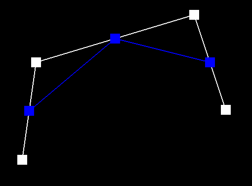
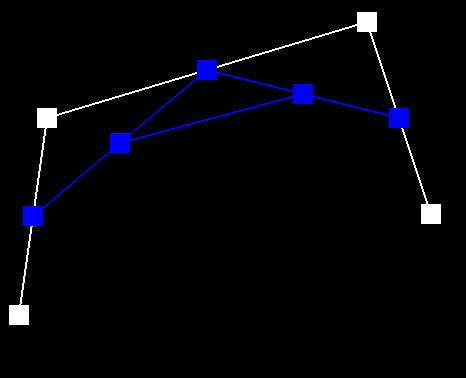
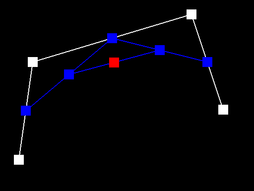
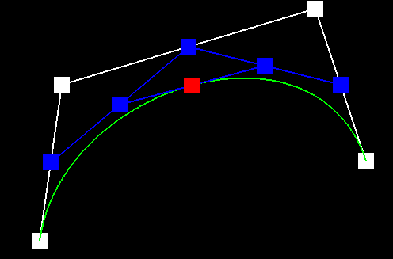
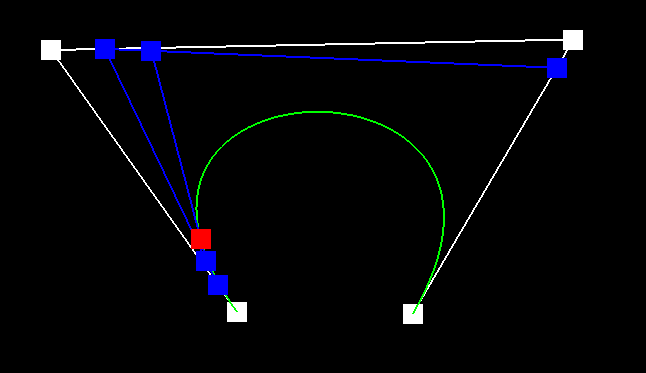
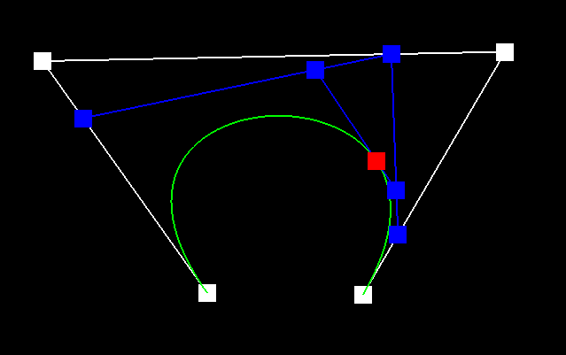

<script src="https://cdn.mathjax.org/mathjax/latest/MathJax.js?config=TeX-AMS-MML_HTMLorMML" type="text/javascript"></script>

# Setup

The project is compiled with `Apple clang version 14.0.0`.
All tests are performed on a 2021 MacBook Pro with Apple M1 Pro CPU (ARM) with default resolution 1600x1200 (unless otherwise specified).

# Overview

In this assignment, by finishing the first two sections, we investigated several topics such as Bezier curves and surfaces using the de Casteljau algorithm, half-edge data structure, and loop subdivision. In this writeup, we will explain each algorithm we discovered and elaborate on how the details are implemented.

# Section I: Bezier Curves and Surfaces
## Part 1: Bezier Curves with 1D de Casteljau Subdivision
De Casteljau's algorithm is a recursive algorithm used to evaluate Bezier curves. It works by performing **linear interpolation** function on two consecutive control points (two control points should be in the same level), until there is only one single point at certain level, which is the point on the Bezier curve corresponding to the given parameter value.

With a parameter `t`, and a set of control points at a specific level, the **linear interpolation** function, or `lerp` is the follow
$$p^{'}_{i} = lerp(p_{i}, p_{i+1}, t)=(1-t)p_{i} + tp_{i+1}$$
And the implementation is as the following.
```cpp
    T inline lerp(const T& a, const T& b, double t) {
        return (1 - t) * a + t * b;
    }
```
We evaluated the curve by recursively performing `lerp` at one level, and generating the control points for the next level, until there is one single point at certain level.
```cpp
    std::vector<T> npts(points.size() - 1, T()); // init new control points for the next level
    for (int i = 0; i < points.size() - 1; ++i)  // perform lerp on consecutive points
    { 
        npts[i] = lerp(points[i], points[i + 1], t);
    }
    return npts; // return the points for the next level
```
We captured screen shots for each level of the evaluation, as well as a curve on the final level. The control points and the parameter `t` were modified slightly in the last two screen shots.
||||||
## Part 2: Bezier Surfaces with Separable 1D de Casteljau

# Section II: Triangle Meshes and Half-Edge Data Structure
## Part 3:  Area-Weighted Vertex Normals
## Part 4: Edge Flip
## Part 5: Edge Split
## Part 6: Loop Subdivision for Mesh Upsampling


