

# Setup

This page is avaliable at <https://cal-cs184-student.github.io/sp23-proj-webpage-hiro/project3-2/project3.html>

The project is compiled with `Apple clang version 14.0.0` and `Linux GCC`.

# Overview

## Part 2: Microfacet Material

| $$\alpha=0.005$$                                              | $$\alpha=0.05$$                                              |
| ------------------------------------------------------------- | ------------------------------------------------------------ |
| 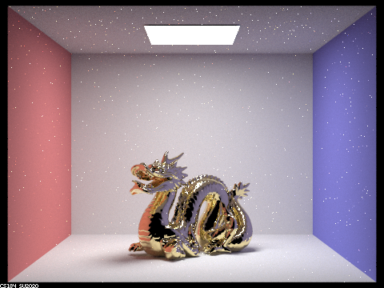 | 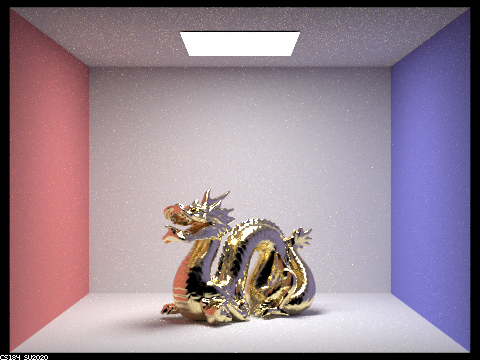 | 

|$$\alpha=0.25$$                                              | $$\alpha=0.5$$                                              |
|------------------------------------------------------------ | ----------------------------------------------------------- |
|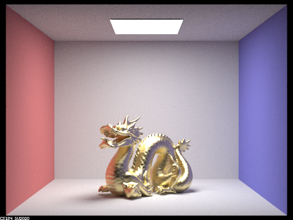 | 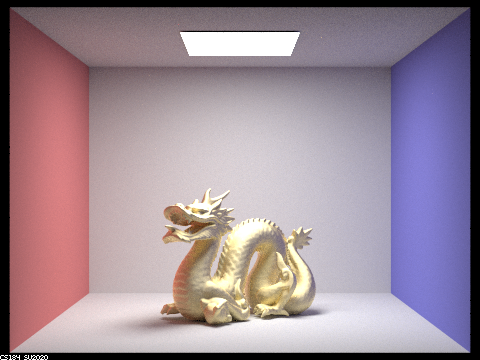 |

$$\alpha$$ is the roughness constant for the material. Increasing the value of $$\alpha$$ will increase the amount of scattering and reflection of light from the surface, resulting in a more diffused and blurry appearance. Decreasing the value of $$\alpha$$ will result in less scattering and reflection and a sharper appearance since the surface is more smooth. In the case of rendering scene `CBdragon_microfacet_au.dae`, increasing the value of $$\alpha$$ from 0.005 to 0.5 would increase the roughness of the gold, causing it to appear increasingly diffused. A lower $$\alpha$$ value would result in a sharper appearance. The effect of the $$\alpha$$ parameter can be particularly noticeable in the highlights and reflections on the surface of the gold material.

| Hemisphere Sampling                                        | Importance Sampling                                        |
| ---------------------------------------------------------- | ---------------------------------------------------------- |
| 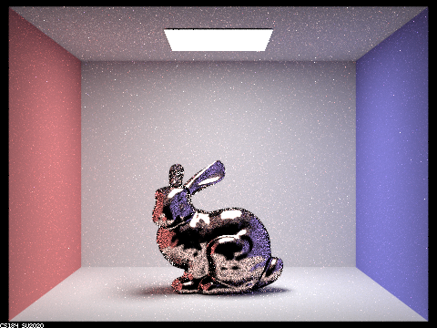 | 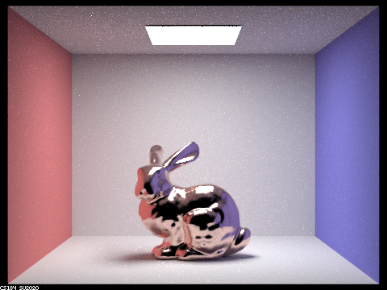 |

Rendering scene `CBbunny_microfacet_cu.dae` using importance sampling instead of cosine hemisphere sampling resulted in a reduction in noise (black spots on the object surface) and an increase in the quality of the highlights and reflections on the surface of the copper material. 

| Material: Iron                                               |
| ------------------------------------------------------------ |
| 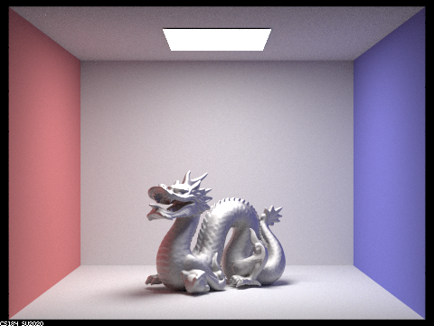 |

The material we picked for rendering the scene is iron (Fe). The parameters are $$\eta=(2.8851 2.9500 2.6500)$$ and $$k=(3.0449 2.9300 2.8075)$$.

## Part 4: Depth of Field

Both the pinhole camera model and the thin-lens camera model are simplified models used in computer graphics and computer vision to simulate and analyze the behavior of cameras. The main difference between the two models is that the pinhole camera model uses a very small aperture or hole (i.e., all light goes through one point) to project the image onto the camera sensor or film. The thin-lens camera model uses a lens to refract and focus the light onto the sensor or film. The thin-lens camera model is more complex than the pinhole camera model and can simulate more realistic camera behaviors, such as depth of field and lens distortion.

Here are rendering of the golden dragon at lens radius 0.3 with different point of focus

| Focus at the Mouth Tip                                            | Focus at the horn                                         |
| ------------------------------------------------------------- | ------------------------------------------------------------ |
| 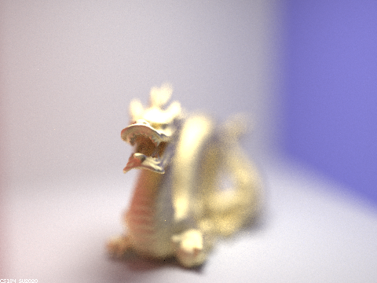 |  | 

| Focus at the Body                                           | Focus at the tail                                            |
|------------------------------------------------------------ | ----------------------------------------------------------- |
|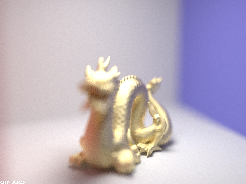 | 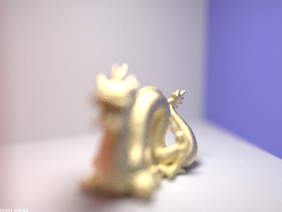 |

Here are renderings of the bronze bunny at different lens radius

| Lens Radius 0.0                                           | Lens Radius 0.1                                   |
| ------------------------------------------------------------- | ------------------------------------------------------------ |
| 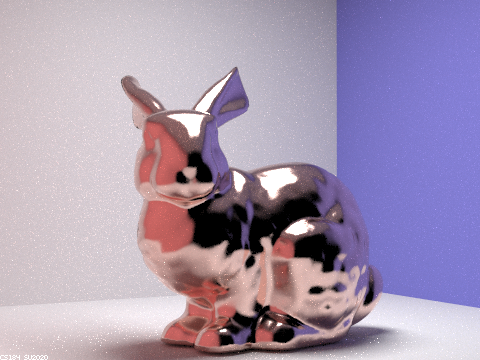 | 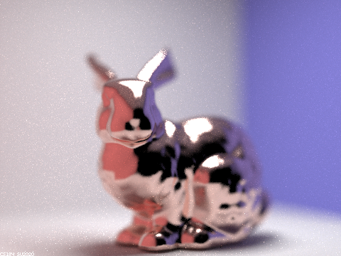 | 

| Lens Radius 0.2                                            | Lens Radius 0.3                                                   |
|------------------------------------------------------------ | ----------------------------------------------------------- |
|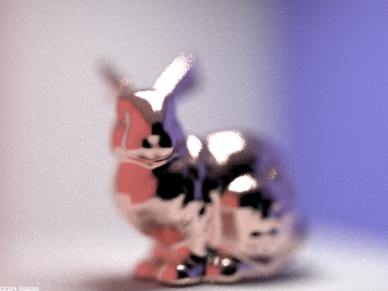 | 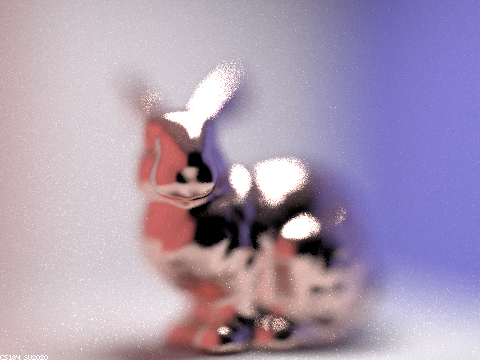 |