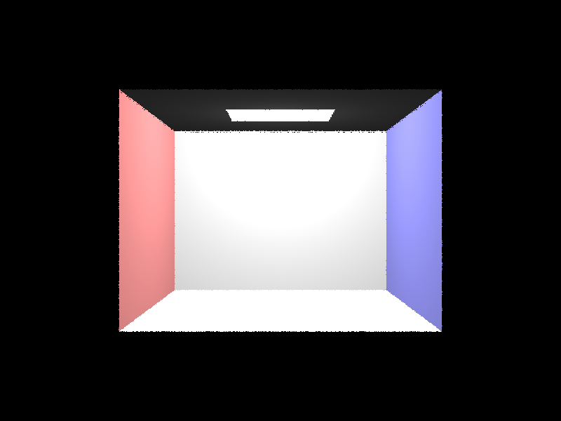
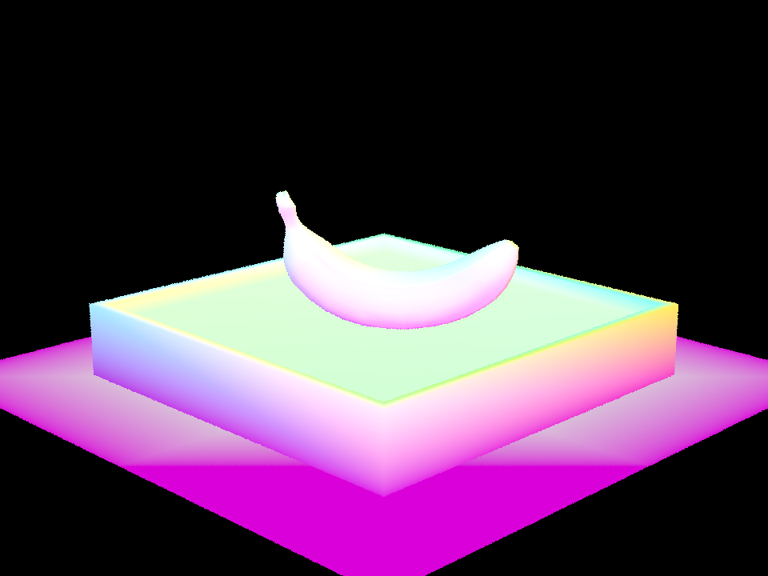

# Setup

The project is compiled with `Apple clang version 14.0.0`.
All tests are performed on a 2021 MacBook Pro with Apple M1 Pro CPU (ARM).

# Overview

## Part 1: Ray Generation and Scene Intersection

In this part, we implemeted ray-surface intersection for a given input `Ray` and a `Triangle` or `Sphere` primitive.

Our overall flow looks like following:

1. For each pixel `(x, y)` on screen, `ns_aa` amount of rays are generated and sampled by calling `camera->generate_ray(x_sample / width, y_sample / height)`. Here, `x_sample` and `y_sample` are sampled position within the pixel (i.e., `x <= x_sample <= x + 1` and `y <= y_sample <= y + 1`). Note we also normalize the position against `width` and `height` for easier change of coordinate system. The `x_sample` and `y_sample` becomes the direction of the ray.
2. We notice that to change the coordinate system from the normalized screen space to camera space, we can perform an affine transformation on the screen space pixel. We first need to scale the screen space position by $$2\tan(\frac{hFov}{2})$$ on the $$x$$-axis and $$2\tan(\frac{vFov}{2})$$ on the $$y$$-axis. That is, the transform matrix is
    $$
    \begin{pmatrix}
        2\tan(\frac{hFov}{2}) & 0 & -\tan(\frac{hFov}{2}) \\
        0 & 2\tan(\frac{vFov}{2}) & -\tan(\frac{vFov}{2}) \\
        0 & 0 & 1
    \end{pmatrix}
    $$
3. Lastly, to change this position to a direction, we change the `.z` component of the vector to -1 and normalize. Now we obtained the direction of the ray in camera space. To convert this back to world space coordinate direction we multiple the given `c2w` matrix with this vector.
4. A new `ray` is created with origin `pos` (given) and direction obtained with above steps.
5. After obtaining the new `Ray r` we then loop over each primitive `p` and call `p->intersect(r)` to check if `r` hits any primitive, and update the `max_t` if it does hit. (Note: this step is further optimized in Task 2).
6. We then assign color value based on the normal of the nearest intersected object (Note: this step is changed in Task 3)

For our triangle intersection algorithm, we used Moller-Trumbore:

1. We compute `E1`, `E2`, `S`, `S1` and `S2` using method described on [this slide](https://cs184.eecs.berkeley.edu/sp23/lecture/9-22/intro-to-ray-tracing-and-acceler)
2. We then compute `t`, `b_1` and `b_2` from `E1`, `E2`, `S`, `S1` and `S2` computed above as well as `D` (direction of the ray)  
   Essentially, we are computing the Barycentric coordinate of the point where the ray hits the plane the triangle is on.
3. After the Moller-Trumbore algorithm, we get `[t, b_1, b_2]`. Then we use the variables to test if the intersection point is inside the triangle and within the line segment of the ray.
    - It is inside the line segment of the ray if `t <= t_max` and `t >= t_min`.
    - It is inside the triangle if satisfies the Barycentric constraint `b1 >= 0 && b1 <= 1 && b2 >= 0 && b2 <= 1 && 1 - b1 - b2 >= 0 && 1 - b1 - b2 <= 1`
4. If the above conditions are met, then the intersection data `isect` is updated accordingly. The method returns true if an intersection occurs and false otherwise.

Here are some images we rendered after completing these tasks

| CBempty                                                | Cube                                                |
| ------------------------------------------------------ | --------------------------------------------------- |
|  |  |

| CBshphere                                               | Plane                                                |
| ------------------------------------------------------- | ---------------------------------------------------- |
|  |  |

## Part 2: Bounding Volume Hierarchy

In this part, we constructs a BVH (Bounding Volume Hierarchy) tree data structure from a vector of primitives. The BVH tree is built using a top-down recursive approach, starting with the root node that encloses all primitives, and recursively splitting the primitives into smaller groups until the maximum leaf size is reached.

The `construct_bvh` function takes a vector of primitives and a maximum leaf size as input arguments, and calls the `split_bvh` function with the same input arguments. In general, the `split_bvh` function recursively splits the primitives into smaller groups, and returns a pointer to the current BVH node.

1. First, the algorithm creates a new BVH node with the bounding box that bounds every primitive in the given range. Then it checks if the number of primitives in the range is less than or equal to the maximum leaf size. If so, it sets the start and end iterators of the current node to the input iterators and returns the node as a leaf node. Otherwise the algorithm calculates the average centroid of all the primitives. We decided to use the average of centroid as the split point in our implementation.
2. If the number of primitives is greater than the maximum leaf size, it needs to split the primitives into two smaller groups. Given a split point, there three ways to split the points using axis aligned boxes (i.e., split parallel to the `x`, `y` or `z` axis). To compute the most efficient split, we count the number of primitives that would fall in the left and right child for all three ways of splitting. We then take the most balanced (i.e., $$\min(\vert \|L_i\|-\|R_i\| \vert)$$) where $$L_i, R_i$$ is the set of primitives in the left and right children if we split along the $i$-th axis.
3. Next, it performs an in-place partition of the primitives based on their centroid coordinates along the chosen axis from above step, such that all the primitives on the left side of the split come before all the primitives on the right side. It then recursively calls the `split_bvh` function on the left and right groups of primitives, and sets the left and right child nodes of the current node to the returned nodes
4. Returns the current node pointer.

The following are some examples with many primitives that rendering without BVH could take very very long.

| CBlucy                                                | Dragon                                                |
| ----------------------------------------------------- | ----------------------------------------------------- |
|  |  |

We also compared rendering time with and without BVH. The following test is performed with all default parameter and resolution 480 x 360. All results are average of three runs.

| File                  | Rendering                                      | Without BVH | With BVH |
| --------------------- | ---------------------------------------------- | ----------- | -------- |
| `meshedit/teapot.dae` |   | 10.5519s    | 0.5114s  |
| `keenan/banana.dae`   |   | 10.8643s    | 0.2152s  |
| `sky/CBempty.dae`     |  | 0.1392s     | 0.1444s  |

We see that BVH optimization greatly reduced the rendering time for more complex meshes due to the `O(log n)` asymptotic complexity. However, as we shown in the example for `CBempty.dae`, the performance of BVH is very close to the non-optimized version when the mesh is simple. This is because as there is not many premitives, there aren't anything the BVH can help skip when tracing the ray. Therefore, performance of BVH would be similar to the naive approach.

## Part 3: Direct Illumination

We implemented two sampling methods for direct illumination: Uniform Hemisphere Sampling and Lighting Importance Sampling. The two methods shared similar general flow (sample, compute light coming from sampled direction, normalize). We discuss the flow in detail below:

#### _1. Direct Lighting with Uniform Hemisphere Sampling_

Here are the steps of our implementation of `estimate_direct_lighting_hemisphere`

1. Create a coordinate system for the hit point `isect`, with the surface normal `isect.n` aligned with the Z-axis.
2. Compute the hit point `hit_p` and the light outgoing direction `w_out` by transforming the ray direction `r.d` into object space using the inverse of the coordinate system.
3. Samples points uniformly from an unit hemisphere centered on `hit_p`. Set the number of samples to be the total number of area light samples multiplied by the number of lights in the scene.  
4. For each sample, it traces a ray in the sampled direction `w_i` (converted to world space for ray generation) to see if it hits an object in the scene.
5. If the new ray hits something, compute the light coming from that object (since only light source would emit light, if the hit object is not a lightsource, it would not contribute anything). The computation is done by the reflection model we studied in lecture, that is the product of BSDF at the original hitpoint `hit_p`, the light emitted from object we hit in step 4 and the $$\cos \theta$$ term computed using the sampled direction `w_i` from step 4. This product is further divided by the PDF ($$2\pi$$ in this case) for normalizing over Monte-Carlo integration estimator.
5. The total contribution is then accumulated over all samples and divided by the number of samples to produce an estimate of the direct lighting at the intersection point (i.e., the $$\frac{1}{N}$$ term in the Monte-Carlo integration estimator)

#### _2. Direct Lighting by Importance Sampling Lights_

Here are the steps of our implementation of `estimate_direct_lighting_importance`. 

1. Similar to the above implementation, the first step is to create a local coordinate system at the intersection point with the surface normal aligned with the Z direction.
2. Next, for each light in the scene, the function samples `ns_area_light` points on the light source, or just one if the light is a delta light (i.e., a point source). For each sample, a outgoing angle `w_i` to the light, the distance to the light source, the probability density function (PDF) for the sample, and the emitted radiance are obtained by calling the `sample_L` function on the light source.
3. Trace a ray from the object to the light using the direction `w_i` and origin `hit_p`, this time, with maximum `t` value set as the distance to the light.
4. If the ray hit something, it means an object is in between the the lightsource and the target, thus there should not be direct illumination (i.e., shadow). However, if the ray hits nothing, then it means the light from the lightsource could hit the object.
5. We then compute the individual sample light contribution using the same computation method described in the Uniform Hemisphere Sampling case above (using the PDF obtained in step 2 for normalizing).
5. The contributions from all samples on the light source are averaged, and the loop moves on to the next light source. The final result is the sum of the contributions from all light sources in the scene, averaged by the number of samples per light source.

Here are some image we rendered using direct illumination with both sampling methods: We used 16 sample per pixel and 8 light rays per light (i.e., `-s 16 -l 8`)

|Scene| Uniform Hemisphere Sample | Lighting Importance Sample |
|-----|---------------------------|----------------------------|
|`sky/CBbunny.dae`| | |
|`sky/CBspheres_lambertian.dae`| | |

Here, we also compare effect of different amount of light rays: We used 1 sample per pixel and Importance sampling using the `sky/CBbunny.dae` (i.e., `-s 1`)

| 1 Light Ray per Light (`-l 1`) | 4 Light Ray per Light (`-l 4`) |
|---------------------------|----------------------------|
|||

| 16 Light Ray per Light (`-l 16`) | 64 Light Ray per Light (`-l 64`) |
|---------------------------|----------------------------|
|||

**Analysis**: We noticed that importance sampling greatly reduced the noise in the rendered image compared to uniform hemisphere sampling under the same parameter value. This is expected since in hemisphere sampling, the shadow ray is sampled uniformly and since there is only one area lightsource (at the top), most shadow ray would hit something else or hit nothing which then returns 0 randiance for that sample. Importance sampling, on the other hand, guarantees that every shadow ray would hit the light unless something in between blocks the ray. Therefore, for the same amount of sampling, the importance sampling method would use these samples more efficiently (i.e., all sample would contribute to something), thus less noise.

We also noticed that the noise in soft shadow decreases with the increase of light ray per light in importance sampling. This is also expected since the light source in the scene we used is an area light. Since the light spans over an area, there could be different direction the ray could trace from the object to light source. Therefore, with 1 light ray, the light is either blocked or not causing black dots in the soft shadow (i.e., noise). With more light rays, we can average out light from different direction thus creating grey (i.e., lighter black) hence the soft shadow.

## Part 4: Global Illumination

Global illumination is implemented using the recursive solution to the rendering function discussed in lecture. 

The implementation of global illumination, or `at_least_one_bounce_radiance` function, is the following:

1. Similar to direct lighting functions, the first thing is to compute the coordinate space matrix for the surface normal at the intersection point. It then computes the hit point using the ray equation, and transforms the outgoing ray direction into the local coordinate space of the intersection point.
2. Next, the method checks if the current ray depth exceeds the maximum depth specified in the Path Tracer object. If it does, the method returns zero radiance, since the ray has reached its maximum depth and should no longer bounce.
3. If the maximum depth has not been reached, the method computes the radiance contribution from the first bounce (i.e., direct light) using the `one_bounce_radiance()` method.
4. Then, the method samples the BSDF at the intersection point to obtain a new incoming ray direction, w_i, and the probability density function pdf for the direction. It constructs a new Ray ray2 with the hit point and incoming direction transformed back to world space.
5. The method then checks if this new ray hits any geometry in the scene using the BVH acceleration structure, and if it does, and the Russian Roulette coin flip passes, it recursively computes the radiance contribution from the new intersection point using the `at_least_one_bounce_radiance()` method.
6. The final radiance contribution is the sum of the radiance from the first bounce and the radiance from the new intersection point, weighted by the BSDF evaluation, the cosine of the angle between the incoming and outgoing directions, and the inverse of the PDF, all divided by the constant `RUSSIAN_ROULETTE_CONT_PROB`, the probability of continuing the path (Russian Roulette probability).

**NOTE:** we hard coded Russian Roulette Countinue Probability to 0.8 for all the following rendering

Here are some images rendered with global illumination, using 1024 sample per pixel and maximum ray depth 5 (i.e., `-s 1024 -m 5`)

|Scene| Render | 
|-----|---------------------------|
|`sky/CBbunny.dae`| |
|`sky/CBspheres_lambertian.dae`| |

We rendered the bunny scene with only direct lighting and indirect lighting. For indirect lighting, we used maximum ray depth 5. Both images use 1024 samples per pixel:

| Only Direct Light | Only Indirect Light|
|-----|----|
|||

For `sky/CBbunny.dae`, we also rendered different max ray depth, again using 1024 sample per pixel (`-s 1024`)

| Max Ray Depth 0 (`-m 0`) | Max Ray Depth 1 (`-m 1`) |
|-----|----|
|||

| Max Ray Depth 2 (`-m 0`) | Max Ray Depth 3 (`-m 3`) |
|-----|----|
|||

| Max Ray Depth 5 (`-m 5`) | Max Ray Depth 100 (`-m 100`) |
|-----|----|
|||

We noticed that the scene has become increasing brighter with the increase of max ray depth. However, the rate is slowing down drastically for max ray depth greater than 3.

Specifically, we found max ray depth of 100 and max ray depth of 5 have very similar probability. This is most likely caused by Russian Roulette (i.e., the expected bounce before RR kills the ray is 5).

We also rendered the bunny scene with various sample per pixel, . 

| 1 Sample Per Pixel (`-s 1`) | 2 Sample Per Pixel (`-s 2`) |
|-----|----|
|||

| 4 Sample Per Pixel (`-s 4`) | 8 Sample Per Pixel (`-s 8`) |
|-----|----|
|||

| 16 Sample Per Pixel (`-s 16`) | 64 Sample Per Pixel (`-s 64`) |
|-----|----|
|||

| 512 Sample Per Pixel (`-s 512`) | 1024 Sample Per Pixel (`-s 1024`) |
|-----|----|
|||

We can see from these rendering that noise level decreases as we increase sample per pixel rate. This is because with increasing sample per pixel rate, the rendering (which is an estimation using Monte-Carlo integration) converges more to the truth. 

## Part 5: Adaptive Sampling
