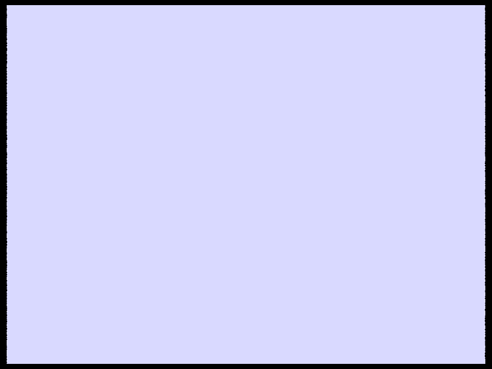

# Setup

The project is compiled with `Apple clang version 14.0.0`.
All tests are performed on a 2021 MacBook Pro with Apple M1 Pro CPU (ARM).

# Overview

## Part 1: Ray Generation and Scene Intersection

In this part, we implemeted ray-surface intersection for a given input `Ray` and a `Triangle` or `Sphere` primitive.

Our overall flow looks like following:

1. For each pixel `(x, y)` on screen, `ns_aa` amount of rays are generated and sampled by calling `camera->generate_ray(x_sample / width, y_sample / height)`. Here, `x_sample` and `y_sample` are sampled position within the pixel (i.e., `x <= x_sample <= x + 1` and `y <= y_sample <= y + 1`). Note we also normalize the position against `width` and `height` for easier change of coordinate system. The `x_sample` and `y_sample` becomes the direction of the ray.
2. We notice that to change the coordinate system from the normalized screen space to camera space, we can perform an affine transformation on the screen space pixel. We first need to scale the screen space position by $$2\tan(\frac{hFov}{2})$$ on the $$x$$-axis and $$2\tan(\frac{vFov}{2})$$ on the $$y$$-axis. That is, the transform matrix is
    $$
    \begin{pmatrix}
        2\tan(\frac{hFov}{2}) & 0 & -\tan(\frac{hFov}{2}) \\
        0 & 2\tan(\frac{vFov}{2}) & -\tan(\frac{vFov}{2}) \\
        0 & 0 & 1
    \end{pmatrix}
    $$
3. Lastly, to change this position to a direction, we change the `.z` component of the vector to -1 and normalize. Now we obtained the direction of the ray in camera space. To convert this back to world space coordinate direction we multiple the given `c2w` matrix with this vector.
4. A new `ray` is created with origin `pos` (given) and direction obtained with above steps.
5. After obtaining the new `Ray r` we then loop over each primitive `p` and call `p->intersect(r)` to check if `r` hits any primitive, and update the `max_t` if it does hit. (Note: this step is further optimized in Task 2).
6. We then assign color value based on the normal of the nearest intersected object (Note: this step is changed in Task 3)

For our triangle intersection algorithm, we used Moller-Trumbore:

1. We compute `E1`, `E2`, `S`, `S1` and `S2` using method described on [this slide](https://cs184.eecs.berkeley.edu/sp23/lecture/9-22/intro-to-ray-tracing-and-acceler)
2. We then compute `t`, `b_1` and `b_2` from `E1`, `E2`, `S`, `S1` and `S2` computed above as well as `D` (direction of the ray)  
   Essentially, we are computing the Barycentric coordinate of the point where the ray hits the plane the triangle is on.
3. After the Moller-Trumbore algorithm, we get `[t, b_1, b_2]`. Then we use the variables to test if the intersection point is inside the triangle and within the line segment of the ray.
    - It is inside the line segment of the ray if `t <= t_max` and `t >= t_min`.
    - It is inside the triangle if satisfies the Barycentric constraint `b1 >= 0 && b1 <= 1 && b2 >= 0 && b2 <= 1 && 1 - b1 - b2 >= 0 && 1 - b1 - b2 <= 1`
4. If the above conditions are met, then the intersection data `isect` is updated accordingly. The method returns true if an intersection occurs and false otherwise.

Here are some images we rendered after completing these tasks

| CBempty                                                | Cube                                                |
| ------------------------------------------------------ | --------------------------------------------------- |
|  |  |

| CBshphere                                               | Plane                                                |
| ------------------------------------------------------- | ---------------------------------------------------- |
|  |  |

## Part 2: Bounding Volume Hierarchy

In this part, we constructs a BVH (Bounding Volume Hierarchy) tree data structure from a vector of primitives. The BVH tree is built using a top-down recursive approach, starting with the root node that encloses all primitives, and recursively splitting the primitives into smaller groups until the maximum leaf size is reached.

The `construct_bvh` function takes a vector of primitives and a maximum leaf size as input arguments, and calls the `split_bvh` function with the same input arguments. In general, the `split_bvh` function recursively splits the primitives into smaller groups, and returns a pointer to the current BVH node.

1. First, the algorithm creates a new BVH node with the bounding box that bounds every primitive in the given range. Then it checks if the number of primitives in the range is less than or equal to the maximum leaf size. If so, it sets the start and end iterators of the current node to the input iterators and returns the node as a leaf node. Otherwise the algorithm calculates the average centroid of all the primitives. We decided to use the average of centroid as the split point in our implementation.
2. If the number of primitives is greater than the maximum leaf size, it needs to split the primitives into two smaller groups. Given a split point, there three ways to split the points using axis aligned boxes (i.e., split parallel to the `x`, `y` or `z` axis). To compute the most efficient split, we count the number of primitives that would fall in the left and right child for all three ways of splitting. We then take the most balanced (i.e., $$\min(\vert \|L_i\|-\|R_i\| \vert)$$) where $$L_i, R_i$$ is the set of primitives in the left and right children if we split along the $i$-th axis.
3. Next, it performs an in-place partition of the primitives based on their centroid coordinates along the chosen axis from above step, such that all the primitives on the left side of the split come before all the primitives on the right side. It then recursively calls the `split_bvh` function on the left and right groups of primitives, and sets the left and right child nodes of the current node to the returned nodes
4. Returns the current node pointer.

The following are some examples with many primitives that rendering without BVH could take very very long.

| CBlucy                                                | Dragon                                                |
| ----------------------------------------------------- | ----------------------------------------------------- |
|  |  |

We also compared rendering time with and without BVH. The following test is performed with all default parameter and resolution 480 x 360. All results are average of three runs.

| File                  | Rendering                                      | Without BVH | With BVH |
| --------------------- | ---------------------------------------------- | ----------- | -------- |
| `meshedit/teapot.dae` |   | 10.5519s    | 0.5114s  |
| `keenan/banana.dae`   |   | 10.8643s    | 0.2152s  |
| `sky/CBempty.dae`     |  | 0.1392s     | 0.1444s  |

We see that BVH optimization greatly reduced the rendering time for more complex meshes due to the `O(log n)` asymptotic complexity. However, as we shown in the example for `CBempty.dae`, the performance of BVH is very close to the non-optimized version when the mesh is simple. This is because as there is not many premitives, there aren't anything the BVH can help skip when tracing the ray. Therefore, performance of BVH would be similar to the naive approach.

## Part 3: Direct Illumination

1. First, it calculates the bounding box of all the primitives in the given range, and calculates the average centroid of all the primitives. It then creates a new BVH node with the bounding box, and checks if the number of primitives in the range is less than or equal to the maximum leaf size. If so, it sets the start and end iterators of the current node to the input iterators and returns the node as a leaf node.
2. If the number of primitives is greater than the maximum leaf size, it needs to split the primitives into two smaller groups. To do this, it first calculates the number of primitives on the left and right sides of the average centroid along each axis. It then chooses the axis with the smallest difference between the number of primitives on the left and right sides, and calculates the number of primitives on each side of the split along that axis.
3. Next, it performs an in-place partition of the primitives based on their centroid coordinates along the chosen axis, such that all the primitives on the left side of the split come before all the primitives on the right side. It then recursively calls the split_bvh function on the left and right groups of primitives, and sets the left and right child nodes of the current node to the returned nodes
4. Returns the current node pointer.

| CBbunny                                                | CBlucy                                               |
| ------------------------------------------------------ | ---------------------------------------------------- |
|  |  |

## Part 3: Direct Illumination

#### _1. Direct Lighting with Uniform Hemisphere Sampling_

Here are the steps of our implementation of `estimate_direct_lighting_hemisphere`

1. Create a coordinate system for the hit point `isect`, with the surface normal `isect.n` aligned with the Z-axis.
2. Compute the hit point `hit_p` and the outgoing direction `w_out` by transforming the ray direction `r.d` into object space using the inverse of the coordinate system.
3. Then, it samples points on a hemisphere around the intersection point. Set the number of samples to be the total number of area light samples multiplied by the number of lights in the scene. And for each sample, it traces a ray in the sample direction to see if it hits an object in the scene.
4. If it does, then compute the contribution of the light at intersection `isect2` by evaluating the product of the BSDF value at `isect` for the outgoing direction `w_out`, the emission of the light at `isect2`, and the cosine of the angle between `w_i` and the surface normal at `isect2`.
5. The total contribution is then accumulated over all samples and divided by the number of samples to produce an estimate of the direct lighting at the intersection point.

#### _2. Direct Lighting by Importance Sampling Lights_

Here are the steps of our implementation of `estimate_direct_lighting_importance`

1. Similar to the above implementatio, the first step is to create a local coordinate system at the intersection point with the surface normal aligned with the Z direction.
2. Next, for each light in the scene, the function samples `ns_area_light` points on the light source, or just one if the light is a delta light (i.e., a point source). For each sample, a ray is traced from the intersection point towards the light source, and the distance to the light source, the probability density function (pdf) for the sample, and the emitted radiance are obtained by calling the `sample_L` function on the light source.
3. If the radiance is nonzero, a new ray is traced from the intersection point towards the sampled point on the light source, and the intersection with other scene geometry is checked. If the ray intersects any geometry, the contribution of the light source is not visible at the intersection point and the loop moves on to the next sample.
4. If the ray does not intersect any geometry, the incoming direction w_i of the light at the intersection point is transformed to local coordinates using the `w2o` matrix. The contribution of the light source to the outgoing radiance at the intersection point is computed, similar to the above implementation, by multiplying the emitted radiance, the cosine term, and the BSDF evaluation, and dividing by the pdf of the sample.
5. The contributions from all samples on the light source are averaged, and the loop moves on to the next light source. The final result is the sum of the contributions from all light sources in the scene, averaged by the number of samples per light source.

## Part 4: Global Illumination

## Part 5: Adaptive Sampling
