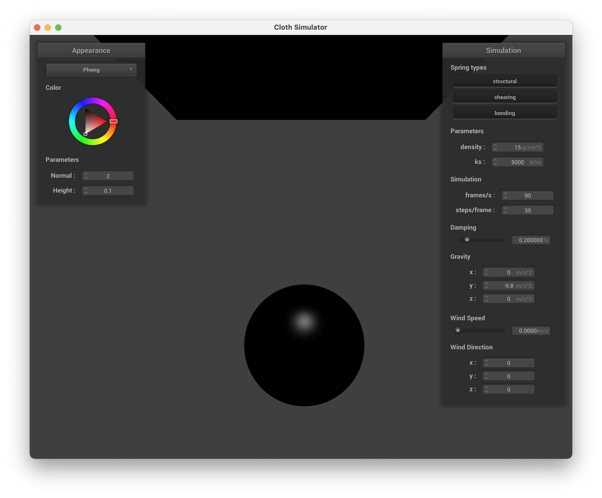
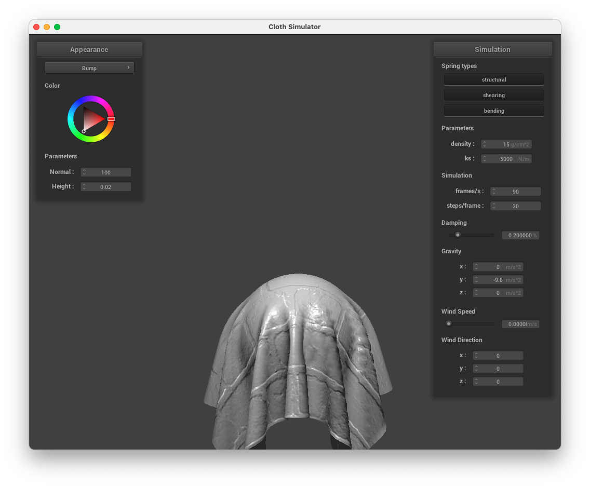

<script src="https://cdn.mathjax.org/mathjax/latest/MathJax.js?config=TeX-AMS-MML_HTMLorMML" type="text/javascript"></script>

<style>
th, td {
  padding: 2px;
}
</style>

# Setup

This page is avaliable at <https://cal-cs184-student.github.io/sp23-proj-webpage-hiro/project4/project4.html>

The project is compiled with `Apple clang version 14.0.3`

# Part 1: Masses and Springs

In this part, we built a evenly spaced grid of point masses connected by springs to represent a cloth. Each spring represents one type of force, `STRUCTUAL`, `SHEARING` and `BENDING`.

Below are some screenshot of the wireframe of the cloth.


Here is the grid with certain constraint turned on and off

**No `SHEARING`**


**Only `SHEARING`**


**Everything**


# Part 2: Simulation via Numerical Integration

In this part, we added simulation of different types of external and spring forces that is exerted on each point mass. We implmeneted the force simulation using Verlet integral over `delta_t`. We also added movement constraint to make the simulation less "dramatic".

## Effect of spring constant `ks`

Spring constant `ks` is basically the stiffness of the spring. Higher `ks` means the spring is harder to stretch and lower `ks` means the spring is easier to stretch. Intuitively speaking, cloth with higher `ks` is harder and more rigid and cloth with lower `ks` is softer.

Therefore, we will observe a larger deformation in cloth with a lower `ks` value. In particular, we will see more wrinkles in cloth with lower `ks` compared to cloth with higher `ks`, since the cloth with lower `ks` can be easily deformed.

Here are two screenshots showing the difference and effect of lower and higher spring constant. Notice there are more wrinke in the lower `ks` image compared to the one with higher `ks`.

| `ks` = 5000 (Default)                                      | `ks` = 50000                                                |
| ---------------------------------------------------------- | ----------------------------------------------------------- |
|  |  |

## Effect of density

Density determines the mass of individual point mass, thus adding up determines the mass of the entire cloth. We expect a higher density would let us simulate a heavier cloth, while a lower density would let us simulate a lighter cloth.

Therefore, for the scene `pinned2.json`, we would observe the cloth to have a larger deformation (i.e., more wrinkles) for higher density value. This is because a heavier point mass would exert a larger gravity force on each spring (since $$f = mg$$) and a ligher point mass would exert a smaller gravity force. Therefore, with higher density, there will be more deformation to the spring, thus more deformation to the simulated cloth.

Below are two screenshots showing the difference of lower and higher density.

| Density = 1                                              | Density = 15 (Default)                                    |
| -------------------------------------------------------- | --------------------------------------------------------- |
|  |  |

## Effect of damping

Damping simulates the loss in energy during the simulation step. With higher damping, we simulate the case where much energy (velocity) accumulated from previous step has been lost during the simulation step, thus there are less "inertia" hence less movement in cloth. With lower damping, we simulate the case where the energy (velocity) from previous step has been well preserved, hence the cloth would be affected more by previous movement / veolocity during current simulation step.

This effect is most clearly observed as with lower damping, the cloth takes much longer to settle to the rest state. This is because the cloth preserves a lot of velocity / energy from previous state, thus the cloth always overshoot the equilibrium state, and will be pulled back by various external force (and overshoot again etc.). Thus it takes longer (much much longer) for the cloth to settle down. However, with higher damping, since the cloth will be mostly affected by only the current force exerting on object, the cloth settle much quicker (since there is less overshoot).

Below are some screenshots taken with different damping. To better illustrate damping, we also included a GIF for each screenshot.

| Damping = 0                                              | Damping = 0.2% (Default)                                 |
| -------------------------------------------------------- | -------------------------------------------------------- |
|  |  |
|  |  |

# Part 3: Handling collisions with other objects

In this part, we handle the collision between the cloth and other objects, in particluar, sphere and a plane. We implemented collision by applying a normal (corrective) position change to the cloth if we detect the object has come in touch with te cloth.

Below are screenshots of the `sphere.json` scene taken at different `ks` values

| `ks = 500`                                                    | `ks = 5000`                                                    | `ks = 50000`                                                    |
| ------------------------------------------------------------- | -------------------------------------------------------------- | --------------------------------------------------------------- |
|  |  |  |

As expected (and discussed) part 2, `ks` spring constant determines how "hard" the cloth would be. The lower `ks`, the softer the cloth and more deformation (thus wrinkles and other stuff), and the harder the cloth the less deformation.

Here, we can clearly get a sense of hardness of the cloth. With `ks = 500`, there is a lot of wrinkles and the cloth hangs down almost vertically. However, with `ks = 50000`, the cloth is not hanging down naturally (i.e., hanging down with an angle outward). The internal force of the spring is pulling each point mass to prevent the cloth from hanging down vertically.

Here is a screenshot of a cloth lying peacefully on a plane (under the Mirror shader)


# Part 4: Handling Self-Collisions

This part aims to implement cloth self-collision to prevent cloth from clipping through and behaving strangely. To achieve this, spatial hashing is used, which involves partitioning the 3D space into 3D boxes, and mapping each point mass's position to a float that represents a specific 3D box volume. `Cloth::hash_position`, `Cloth::build_spatial_map`, and `Cloth::self_collide` methods are implemented. Now, the simulation is updated to account for potential self-collisions by calling self_collide on each PointMass.

# Part 5: Shader

In this part of the assignment, we implemented different shaders for the cloth simulation task.

In simple words, shader programs utilizes the GPU to perform tasks in different stages of the graphic rendering pipeline. It could be viewed as an abstraction towards directly programing the GPU, which could be complicated and vendor dependent (AMD vs Nvidia). The user could use the shader program to adjust the vertex position, lighting, coloring and many more other graphic properties of the rendered object.

In this project, we worked on two types of shader program, vertex shader and fragment shader.

Vertex shader (shader files ending in `.vert`) controls the vertex of the polygon that is being rendered. In our case, our vertex shader computes the position and normal vector of the vertex (in world space), as well as the `uv` vector (used in texture sampling) and tangent vector of the vertex. This code is executed relatively early in the rendering pipeline (so that later stages would be able to use the vertex information).

Fragment shader (shader files ending in `.frag`) controls the final rasterization. That is, these shader programs determines the output color at the given fragement (pixel) with the vertex and texutre information provided.

## Blinn-Phong

Blinn-Phong shader is one step more realistic compared to the simple diffusive shader. Blinn-Phong shader consists of three light components, the ambient light, the diffuse light and the specular light. The final irradiance at the pixel is computed by summing all three component.

Ambient light is basically a constant light that gets projected on to each object in scene uniformly. It is computed as $$k_{a} * I_{a}$$ where both are constant. Therefore, in our implementation, we used a constant 3D vector `(0.18, 0.18, 0.18)` to represent this type of light.

Diffusive light is light reflected by a perfectly diffusive material. It is computed as $$k_{d} \frac{I}{r^2} \max(0, n \cdot l)$$. In our case, we chose $$k_{d}$$ to be the constant 1.

Specular light is the high-light part that is reflected directly towards the camera. It is computed as $$k_{s} \frac{I}{r^2} \max(0, n \cdot h)^p$$. We choose $$k_{s} = 0.7$$ and $$p = 64$$.

Finally, here are some screenshot of the Blinn-Phong shader we implemented

With Only Ambient Light

| Start                                                          | End                                                            |
| -------------------------------------------------------------- | -------------------------------------------------------------- |
|  |  |

With Only Diffusive Light

| Start                                                           | End                                                             |
| --------------------------------------------------------------- | --------------------------------------------------------------- |
|  |  |

With Only Specular Light

| Start                                                           | End                                                             |
| --------------------------------------------------------------- | --------------------------------------------------------------- |
|  |  |

The Blinn-Phong Shader

| Start                                                      | End                                                        |
| ---------------------------------------------------------- | ---------------------------------------------------------- |
|  |  |

## Texture

For the texture shader, we re-used the Campanile image from project 1 as our custom texture, here is the result

| Start                                                    | End                                                      |
| -------------------------------------------------------- | -------------------------------------------------------- |
|  |  |

## Displacement and Bump

Both displacemenet shader and bump shader use the same fragment shader. In the fragment shader is similar to the Blinn-Phong shader, except we modify the normal vector according to the texture to give the illusion of bumps.

In displacement shader, we also modified the vertex shader to actually displace the vertices according to the texture to give a more realistic bumpy rendering.

Bump Shader

| Start                                                     | End                                                       |
| --------------------------------------------------------- | --------------------------------------------------------- |
|  |  |

Displacement Shader

| Start                                                             | End                                                               |
| ----------------------------------------------------------------- | ----------------------------------------------------------------- |
|  |  |

We can see from the above screenshot that with bump shader, we do get an illusion of bumping. However, if we look closely, we see that the edge of the rendered sphere is still a perfect circle. On the other hand, if we look at the displacement shader, we do see that the edge of the sphere is no longer a perfect circle, the vertecies are also "bumping" according to the texture.

We also look at different mesh coarseness. (Ignore the difference in size of the sphere. It is not part of the coarsness issue)

Bump Shader

| `-o 16 -a 16`                                              | `-o 128 -a 128`                                             |
| ---------------------------------------------------------- | ----------------------------------------------------------- |
|  |  |

Displacement Shader

| `-o 16 -a 16`                                                      | `-o 128 -a 128`                                                     |
| ------------------------------------------------------------------ | ------------------------------------------------------------------- |
|  |  |

We see that change of coarsenss has a huge impact on the rendering quality for the displacement shader, but not so much for the bump shader. This is mostly because the resolution of the rendered sphere affects the number of vertices that gets rendered.

In the bump case, vertices are not touched. However, in the displacement case, we are actualy trying to move the vertices around according to the texutre. Therefore, a higher coarseness means there are more vertices we are able to move, thus the final result would look much more realistic.

## Mirror

Here are two screenshots of the mirror shader which reflects the cubic map surrounding the scene `sphere.json`.

| Start                                                       | End                                                         |
| ----------------------------------------------------------- | ----------------------------------------------------------- |
|  |  |

# Extra Credit: Wind Simulation

We can view wind as an invisible viscous fluid (i.e., air) trying to push the cloth in a certain direction. Provot (1995) proposed that we can model such behaviour by the following equation

$$f_{vi} = c_{vi} [n_{i,j} \cdot (u_{fluid} - v_{i,j})] n_{i,j} \hspace{1em} [1]$$

Where $$f_{vi}$$ is the wind force that is exerted on the object, $$c_{vi}$$ is a constant representing the intensity of the force, $$u_{fluid}$$ is the direction of the wind (we assume wind blowing uniformly in one direction), and finally $$n_{i,j}$$ and $$v_{i,j}$$ are the normal vector and velocity of the point mass at position $$(i, j)$$.

Notice that compared to gravity force, wind force exerts a different amount of force on each point mass depending on some properties (velocity and normal vector) of the point mass. Therefore, we cannot simply add another `Vector3D` to the list of external forces. After much consideration, we decided to introduce another class for generalized external forces. The `ExternalForce` class is created as an interface class that provides one method interface `compute_force` with signiture

```{c++}
Vector3D compute_force(PointMass pm, double mass, ouble delta_t);
```

This method would compute the exerted force at the given point mass.

Then both Gravity force and Wind force would inherite this base class and implement the `compute_force` method. For gravity, it is simply returniing a constant `gravity_force * mass` for all point mass; and for Wind, it computes the force exerted on the point mass as described above.

Here are some screenshot showing wind effect on cloth:

For scene `pinned2.json` with wind direction $$(\frac{1}{\sqrt{2}}, 0, \frac{1}{\sqrt{2}})$$ with different intensity

| $$c_{vi} \approx 0.3$$                                    | $$c_{vi} \approx 0.6$$                                    | $$c_{vi} \approx 1$$                                      |
| --------------------------------------------------------- | --------------------------------------------------------- | --------------------------------------------------------- |
|  |  |  |

Here is a GIF for showcasing the wind with the `sphere.json` scene. (Please ignore the strange green dots artifact from converting mov file to GIF).


# Reference

[1] Provot, X. (1995, May). Deformation constraints in a mass-spring model to describe rigid cloth behaviour. In Graphics interface (pp. 147-147). Canadian Information Processing Society.
